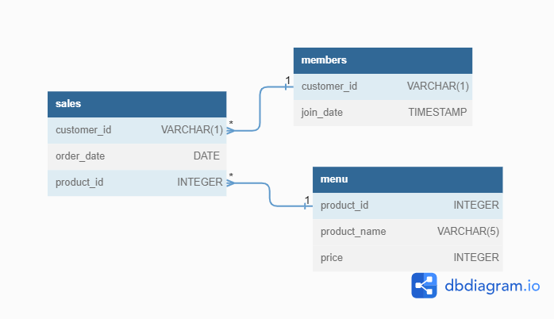

# :ramen: Case Study #1 - Danny's Diner

  <picture>
    
  </picture>

## :books: Table of Contents <!-- omit in toc -->

- [:briefcase: Business Case](#briefcase-business-case)
- [:mag: Entity Relationship Diagram](#mag-entity-relationship-diagram)
- [:bookmark_tabs: Example Datasets](#bookmark_tabs-example-datasets)
- [:triangular_flag_on_post: Questions and Solutions](#triangular_flag_on_post-questions-and-solutions)
  
---

## :briefcase: Business Case

Danny seriously loves Japanese food so in the beginning of 2021, he decides to embark upon a risky venture and opens up a cute little restaurant that sells his 3 favourite foods: sushi, curry and ramen.

Danny’s Diner is in need of your assistance to help the restaurant stay afloat - the restaurant has captured some very basic data from their few months of operation but have no idea how to use their data to help them run the business.

View the complete business case [HERE](https://8weeksqlchallenge.com/case-study-1).

---

## :mag: Entity Relationship Diagram

  <picture>
    
  </picture>	

---

## :bookmark_tabs: Example Datasets

**Table 1: Sales**

| customer_id | order_date | product_id |
| :---------- | :--------- | :--------- |
| A           | 2021-01-01 | 1          |
| A           | 2021-01-01 | 2          |
| A           | 2021-01-07 | 2          |
| A           | 2021-01-10 | 3          |
| A           | 2021-01-11 | 3          |
| A           | 2021-01-11 | 3          |
| B           | 2021-01-01 | 2          |
| B           | 2021-01-02 | 2          |
| B           | 2021-01-04 | 1          |
| B           | 2021-01-11 | 1          |
| B           | 2021-01-16 | 3          |
| B           | 2021-02-01 | 3          |
| C           | 2021-01-01 | 3          |
| C           | 2021-01-01 | 3          |
| C           | 2021-01-07 | 3          |

 

**Table 2: Menu**

| product_id | product_name | price |
| :--------- | :----------- | :---- |
| 1          | sushi        | 10    |
| 2          | curry        | 15    |
| 3          | ramen        | 12    |

 

**Table 3: Member**

| customer_id | join_date  |
| :---------- | :--------- |
| A           | 2021-01-07 |
| B           | 2021-01-09 |

View my database setup in:

---

## :triangular_flag_on_post: Questions and Solutions

### A. Dining Metrics

1. What is the total amount each customer spent at the restaurant?
2. How many days has each customer visited the restaurant?
3. What was the first item from the menu purchased by each customer?
4. What is the most purchased item on the menu and how many times was it purchased by all customers?
5. Which item was the most popular for each customer?
6. Which item was purchased first by the customer after they became a member?
7. Which item was purchased just before the customer became a member?
8. What is the total items and amount spent for each member before they became a member?
9. If each $1 spent equates to 10 points and sushi has a 2x points multiplier - how many points would each customer have?
10. In the first week after a customer joins the program (including their join date) they earn 2x points on all items, 
  not just sushi - how many points do customer A and B have at the end of January?

View my solution in:

---

### B. Ranking All The Things

Danny also requires further information about the `ranking` of customer products, but he purposely does not need the `ranking` for non-member purchases so he expects `NULL` values for the records when customers are not yet part of the loyalty program.

Example outputs for the dataset might look like the following:

| customer_id | order_date | product_name | price | member | ranking |
|-------------|------------|--------------|-------|--------|---------|
| A           | 2021-01-01 | curry        | 15    | N      | null    |
| A           | 2021-01-01 | sushi        | 10    | N      | null    |
| A           | 2021-01-07 | curry        | 15    | Y      | 1       |
| A           | 2021-01-10 | ramen        | 12    | Y      | 2       |
| A           | 2021-01-11 | ramen        | 12    | Y      | 3       |
| A           | 2021-01-11 | ramen        | 12    | Y      | 3       |
| B           | 2021-01-01 | curry        | 15    | N      | null    |
| B           | 2021-01-02 | curry        | 15    | N      | null    |
| B           | 2021-01-04 | sushi        | 10    | N      | null    |
| B           | 2021-01-11 | sushi        | 10    | Y      | 1       |
| B           | 2021-01-16 | ramen        | 12    | Y      | 2       |
| B           | 2021-02-01 | ramen        | 12    | Y      | 3       |
| C           | 2021-01-01 | ramen        | 12    | N      | null    |
| C           | 2021-01-01 | ramen        | 12    | N      | null    |
| C           | 2021-01-07 | ramen        | 12    | N      | null    |

View my solution in:
 

