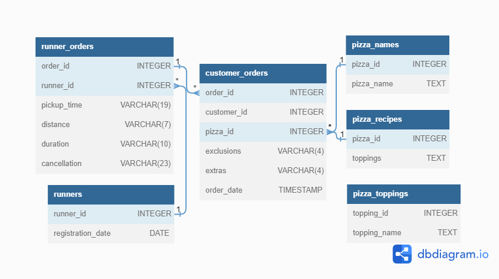

# 🍜 Case Study #1 - Pizza Runner

<div align="center">
  <picture>
    
  </picture>
</div>

## 📚 Table of Contents <!-- omit in toc -->

- [:briefcase: Business Case](#briefcase-business-case)
- [:mag: Entity Relationship Diagram](#mag-entity-relationship-diagram)
- [:bookmark_tabs: Example Datasets](#bookmark_tabs-example-datasets)
- [:triangular_flag_on_post: Questions and Solutions](#triangular_flag_on_post-questions-and-solutions)
  
---

## :briefcase: Business Case

Danny was scrolling through his Instagram feed when something really caught his eye - “80s Retro Styling and Pizza Is The Future!”

Danny was sold on the idea, but he knew that pizza alone was not going to help him get seed funding to expand his new Pizza Empire - so he had one more genius idea to combine with it - he was going to Uberize it - and so Pizza Runner was launched!

Danny started by recruiting “runners” to deliver fresh pizza from Pizza Runner Headquarters (otherwise known as Danny’s house) and also maxed out his credit card to pay freelance developers to build a mobile app to accept orders from customers.

View the complete business case [HERE](https://8weeksqlchallenge.com/case-study-2).

---

## :mag: Entity Relationship Diagram

<div align="center">
  <picture>
    
  </picture>	
</div>

---

## :bookmark_tabs: Example Datasets

<div align="center">

**Table 1: runners**

| runner_id | registration_date |
| :-------- | :---------------- |
| 1         | 2021-01-01        |
| 2         | 2021-01-03        |
| 3         | 2021-01-08        |
| 4         | 2021-01-15        |

</div>

<br>

<div align="center">

**Table 2: customer_orders**

| order_id | customer_id | pizza_id | exclusions | extras | order_time          |
| :------- | :---------- | :------- | :--------- | :----- | :------------------ |
| 1        | 101         | 1        |            |        | 2021-01-01 18:05:02 |
| 2        | 101         | 1        |            |        | 2021-01-01 19:00:52 |
| 3        | 102         | 1        |            |        | 2021-01-02 23:51:23 |
| 3        | 102         | 2        |            | NULL   | 2021-01-02 23:51:23 |
| 4        | 103         | 1        | 4          |        | 2021-01-04 13:23:46 |
| 4        | 103         | 1        | 4          |        | 2021-01-04 13:23:46 |
| 4        | 103         | 2        | 4          |        | 2021-01-04 13:23:46 |
| 5        | 104         | 1        | null       | 1      | 2021-01-08 21:00:29 |
| 6        | 101         | 2        | null       | null   | 2021-01-08 21:03:13 |
| 7        | 105         | 2        | null       | 1      | 2021-01-08 21:20:29 |
| 8        | 102         | 1        | null       | null   | 2021-01-09 23:54:33 |
| 9        | 103         | 1        | 4          | 1, 5   | 2021-01-10 11:22:59 |
| 10       | 104         | 1        | null       | null   | 2021-01-11 18:34:49 |
| 10       | 104         | 1        | 2, 6       | 1, 4   | 2021-01-11 18:34:49 |

</div>

<br>

<div align="center">

**Table 3: runner_orders**

| order_id | runner_id | pickup_time         | distance | duration   | cancellation            |
| :--------| :---------| :-------------------| :--------| :----------| :-----------------------|
| 1        | 1         | 2021-01-01 18:15:34 | 20km     | 32 minutes |                         |
| 2        | 1         | 2021-01-01 19:10:54 | 20km     | 27 minutes |                         |
| 3        | 1         | 2021-01-03 00:12:37 | 13.4km   | 20 mins    | NULL                    |
| 4        | 2         | 2021-01-04 13:53:03 | 23.4     | 40         | NULL                    |
| 5        | 3         | 2021-01-08 21:10:57 | 10       | 15         | NULL                    |
| 6        | 3         | null                | null     | null       | Restaurant Cancellation |
| 7        | 2         | 2020-01-08 21:30:45 | 25km     | 25mins     | null                    |
| 8        | 2         | 2020-01-10 00:15:02 | 23.4 km  | 15 minute  | null                    |
| 9        | 2         | null                | null     | null       | Customer Cancellation   |
| 10       | 1         | 2020-01-11 18:50:20 | 10km     | 10minutes  | null                    |

</div>

<br>

<div align="center">

**Table 4: pizza_names**

| pizza_id | pizza_name  |
| :------- | :---------- |
| 1        | Meat Lovers |
| 2        | Vegetarian  |

</div>

<br>

<div align="center">

**Table 5: pizza_recipes**

| pizza_id | toppings                |
| -------- | ----------------------- |
| 1        | 1, 2, 3, 4, 5, 6, 8, 10 |
| 2        | 4, 6, 7, 9, 11, 12      |

</div>

<br>

<div align="center">

**Table 6: pizza_toppings**

| topping_id | topping_name |
| :--------- | :----------- |
| 1          | Bacon        |
| 2          | BBQ Sauce    |
| 3          | Beef         |
| 4          | Cheese       |
| 5          | Chicken      |
| 6          | Mushrooms    |
| 7          | Onions       |
| 8          | Pepperoni    |
| 9          | Peppers      |
| 10         | Salami       |
| 11         | Tomatoes     |
| 12         | Tomato Sauce |

</div>

---

## :triangular_flag_on_post: Questions and Solutions

### A. Pizza Metrics

1. How many pizzas were ordered?
2. How many unique customer orders were made?
3. How many successful orders were delivered by each runner?
4. How many of each type of pizza was delivered?
5. How many Vegetarian and Meatlovers were ordered by each customer?
6. What was the maximum number of pizzas delivered in a single order?
7. For each customer, how many delivered pizzas had at least 1 change and how many had no changes?
8. How many pizzas were delivered that had both exclusions and extras?
9. What was the total volume of pizzas ordered for each hour of the day?
10. What was the volume of orders for each day of the week?

View my solution in:

[](Solutions/MySQL/A.%20Pizza%20Metrics.md)
[](Solutions/PostgreSQL/A.%20Pizza%20Metrics.md)
[](Solutions/T-SQL/A.%20Pizza%20Metrics.md)

---

### B. Runner and Customer Experience

1. How many runners signed up for each 1 week period? (i.e. week starts 2021-01-01)
2. What was the average time in minutes it took for each runner to arrive at the Pizza Runner HQ to pickup the order?
3. Is there any relationship between the number of pizzas and how long the order takes to prepare?
4. What was the average distance travelled for each customer?
5. What was the difference between the longest and shortest delivery times for all orders?
6. What was the average speed for each runner for each delivery and do you notice any trend for these values?
7. What is the successful delivery percentage for each runner?

View my solutions in:
 
[](Solutions/MySQL/B.%20Runner%20and%20Customer%20Experience.md)
[](Solutions/PostgreSQL/B.%20Runner%20and%20Customer%20Experience.md)
[](Solutions/T-SQL/B.%20Runner%20and%20Customer%20Experience.md)

---

### C. Ingredient Optimisation

1. What are the standard ingredients for each pizza?
2. What was the most commonly added extra?
3. What was the most common exclusion?
4. Generate an order item for each record in the customers_orders table in the format of one of the following:
    * ```Meat Lovers```
    * ```Meat Lovers - Exclude Beef```
    * ```Meat Lovers - Extra Bacon```
    * ```Meat Lovers - Exclude Cheese, Bacon - Extra Mushroom, Peppers```
5. Generate an alphabetically ordered comma separated ingredient list for each pizza order from the customer_orders table and add a 2x in front of any relevant ingredients
    * For example: ```"Meat Lovers: 2xBacon, Beef, ... , Salami"```
6. What is the total quantity of each ingredient used in all delivered pizzas sorted by most frequent first?

View my solutions in:

[](Solutions/MySQL/C.%20Ingredient%20Optimisation.md)
[](Solutions/PostgreSQL/C.%20Ingredient%20Optimisation.md)
[](Solutions/T-SQL/C.%20Ingredient%20Optimisation.md)

---

### D. Pricing and Ratings

1. If a Meat Lovers pizza costs $12 and Vegetarian costs $10 and there were no charges for changes - how much money has Pizza Runner made so far if there are no delivery fees?
2. What if there was an additional $1 charge for any pizza extras?
    * Add cheese is $1 extra
3. The Pizza Runner team now wants to add an additional ratings system that allows customers to rate their runner, how would you design an additional table for this new dataset - generate a schema for this new table and insert your own data for ratings for each successful customer order between 1 to 5.
4. Using your newly generated table - can you join all of the information together to form a table which has the following information for successful deliveries?
    * ```customer_id```
    * ```order_id```
    * ```runner_id```
    * ```rating```
    * ```order_time```
    * ```pickup_time```
    * Time between order and pickup
    * Delivery duration
    * Average speed
    * Total number of pizzas
5. If a Meat Lovers pizza was $12 and Vegetarian $10 fixed prices with no cost for extras and each runner is paid $0.30 per kilometre traveled - how much money does Pizza Runner have left over after these deliveries?
 
View my solutions in:

[](Solutions/MySQL/D.%20Pricing%20and%20Ratings.md)
[](Solutions/PostgreSQL/D.%20Pricing%20and%20Ratings.md)
[](Solutions/T-SQL/D.%20Pricing%20and%20Ratings.md)

---

### E. Bonus Questions

If Danny wants to expand his range of pizzas - how would this impact the existing data design? Write an ```INSERT``` statement to demonstrate what would happen if a new ```Supreme``` pizza with all the toppings was added to the Pizza Runner menu?

View my solutions in:

[](Solutions/MySQL/E.%20Bonus%20Questions.md)
[](Solutions/PostgreSQL/E.%20Bonus%20Questions.md)
[](Solutions/T-SQL/E.%20Bonus%20Questions.md)
