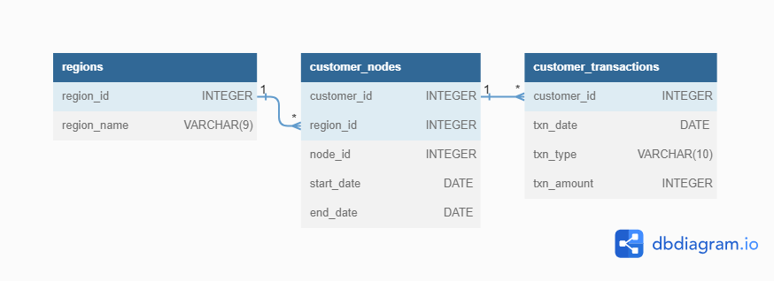

# :bank: Case Study #4 - Data Bank

  <picture>
    
  </picture>

## :books: Table of Contents <!-- omit in toc -->

- [:briefcase: Business Case](#briefcase-business-case)
- [:mag: Entity Relationship Diagram](#mag-entity-relationship-diagram)
- [:bookmark_tabs: Example Datasets](#bookmark_tabs-example-datasets)
- [:triangular_flag_on_post: Questions and Solutions](#triangular_flag_on_post-questions-and-solutions)
  
---

## :briefcase: Business Case

There is a new innovation in the financial industry called Neo-Banks: new aged digital only banks without physical branches.

Danny thought that there should be some sort of intersection between these new age banks, cryptocurrency and the data world…so he decides to launch a new initiative - Data Bank!

Data Bank runs just like any other digital bank - but it isn’t only for banking activities, they also have the world’s most secure distributed data storage platform!

Customers are allocated cloud data storage limits which are directly linked to how much money they have in their accounts. There are a few interesting caveats that go with this business model, and this is where the Data Bank team need your help!

The management team at Data Bank want to increase their total customer base - but also need some help tracking just how much data storage their customers will need.

View the complete business case [HERE](https://8weeksqlchallenge.com/case-study-4).

---

## :mag: Entity Relationship Diagram

  <picture>
    
  </picture>	

---

## :bookmark_tabs: Example Datasets

**Table 1: regions**

| region_id | region_name |
| :-------- | :---------- |
| 1         | Africa      |
| 2         | America     |
| 3         | Asia        |
| 4         | Europe      |
| 5         | Oceania     |

 

**Table 2: customer_nodes**

| customer_id | region_id | node_id | start_date | end_date   |
| :---------- | :-------- | :------ | :--------- | :--------- |
| 1           | 3         | 4       | 2020-01-02 | 2020-01-03 |
| 2           | 3         | 5       | 2020-01-03 | 2020-01-17 |
| 3           | 5         | 4       | 2020-01-27 | 2020-02-18 |
| 4           | 5         | 4       | 2020-01-07 | 2020-01-19 |
| 5           | 3         | 3       | 2020-01-15 | 2020-01-23 |
| 6           | 1         | 1       | 2020-01-11 | 2020-02-06 |
| 7           | 2         | 5       | 2020-01-20 | 2020-02-04 |
| 8           | 1         | 2       | 2020-01-15 | 2020-01-28 |
| 9           | 4         | 5       | 2020-01-21 | 2020-01-25 |
| 10          | 3         | 4       | 2020-01-13 | 2020-01-14 |
| 11          | 2         | 5       | 2020-01-19 | 2020-01-25 |
| 12          | 1         | 2       | 2020-01-13 | 2020-01-14 |
| 13          | 2         | 3       | 2020-01-02 | 2020-01-14 |
| 14          | 1         | 2       | 2020-01-25 | 2020-01-25 |

 

**Table 3: customer_transactions**

| customer_id | txn_date   | txn_type | txn_amount |
| :---------- | :--------- | :------- | :--------- |
| 429         | 2020-01-21 | deposit  | 82         |
| 155         | 2020-01-10 | deposit  | 712        |
| 398         | 2020-01-01 | deposit  | 196        |
| 255         | 2020-01-14 | deposit  | 563        |
| 185         | 2020-01-29 | deposit  | 626        |
| 309         | 2020-01-13 | deposit  | 995        |
| 312         | 2020-01-20 | deposit  | 485        |
| 376         | 2020-01-03 | deposit  | 706        |
| 188         | 2020-01-13 | deposit  | 601        |
| 138         | 2020-01-11 | deposit  | 520        |
| 373         | 2020-01-18 | deposit  | 596        |
| 361         | 2020-01-12 | deposit  | 797        |
| 169         | 2020-01-10 | deposit  | 628        |
| 402         | 2020-01-05 | deposit  | 435        |

View my database setup in:

---

## :triangular_flag_on_post: Questions and Solutions

### A. Customer Nodes Exploration

1. How many unique nodes are there on the Data Bank system?
2. What is the number of nodes per region?
3. How many customers are allocated to each region?
4. How many days on average are customers reallocated to a different node?
5. What is the median, 80th and 95th percentile for this same reallocation days metric for each region?

View my solution in:

---

### B. Customer Transactions

1. What is the unique count and total amount for each transaction type?
2. What is the average total historical deposit counts and amounts for all customers?
3. For each month - how many Data Bank customers make more than 1 deposit and either 1 purchase or 1 withdrawal in a single month?
4. What is the closing balance for each customer at the end of the month?
5. What is the percentage of customers who increase their closing balance by more than 5%?

View my solution in:
 

---

### C. Data Allocation Challenge

To test out a few different hypotheses - the Data Bank team wants to run an experiment where different groups of customers would be allocated data using 3 different options:
  * Option 1: data is allocated based off the amount of money at the end of the previous month
  * Option 2: data is allocated on the average amount of money kept in the account in the previous 30 days
  * Option 3: data is updated real-time

For this multi-part challenge question - you have been requested to generate the following data elements to help the Data Bank team estimate how much data will need to be provisioned for each option:
  * running customer balance column that includes the impact each transaction
  * customer balance at the end of each month
  * minimum, average and maximum values of the running balance for each customer

Using all of the data available - how much data would have been required for each option on a monthly basis?

View my solution in:

---

### D. Extra Challenge

Data Bank wants to try another option which is a bit more difficult to implement - they want to calculate data growth using an interest calculation, just like in a traditional savings account you might have with a bank.

If the annual interest rate is set at 6% and the Data Bank team wants to reward its customers by increasing their data allocation based off the interest calculated on a daily basis at the end of each day, how much data would be required for this option on a monthly basis?

Special notes:
  * Data Bank wants an initial calculation which does not allow for compounding interest, however they may also be interested in a daily compounding interest calculation so you can try to perform this calculation if you have the stamina!

View my solution in:

