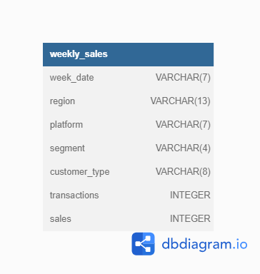

# :shopping_cart: Case Study 5 - Data Mart

  <picture>
    
  </picture>

## :books: Table of Contents <!-- omit in toc -->

- [:briefcase: Business Case](#briefcase-business-case)
- [:mag: Entity Relationship Diagram](#mag-entity-relationship-diagram)
- [:bookmark_tabs: Example Datasets](#bookmark_tabs-example-datasets)
- [:triangular_flag_on_post: Questions and Solutions](#triangular_flag_on_post-questions-and-solutions)
  
---

## :briefcase: Business Case

Data Mart is Danny’s latest venture and after running international operations for his online supermarket that specialises in fresh produce - Danny is asking for your support to analyse his sales performance.

In June 2020 - large scale supply changes were made at Data Mart. All Data Mart products now use sustainable packaging methods in every single step from the farm all the way to the customer.

Danny needs your help to quantify the impact of this change on the sales performance for Data Mart and it’s separate business areas.

The key business question he wants you to help him answer are the following:

  * What was the quantifiable impact of the changes introduced in June 2020?
  * Which platform, region, segment and customer types were the most impacted by this change?
  * What can we do about future introduction of similar sustainability updates to the business to minimise impact on sales?

View the complete business case [HERE](https://8weeksqlchallenge.com/case-study-5).

---

## :mag: Entity Relationship Diagram

  <picture>
    
  </picture>	

---

## :bookmark_tabs: Example Datasets

**Table: weekly_sales**

| week_date | &nbsp;&nbsp;&nbsp;&nbsp;&nbsp;&nbsp;&nbsp;&nbsp;&nbsp;region | platform | segment | customer_type | transactions | &nbsp;&nbsp;&nbsp;&nbsp;&nbsp;sales |
| :-------- | :------------ | :------- | :------ | :------------ | :----------- | :--------- |
| 9/9/20    | OCEANIA       | Shopify  | C3      | New           | 610          | 110033.89  |
| 29/7/20   | AFRICA        | Retail   | C1      | New           | 110692       | 3053771.19 |
| 22/7/20   | EUROPE        | Shopify  | C4      | Existing      | 24           | 8101.54    |
| 13/5/20   | AFRICA        | Shopify  | null    | Guest         | 5287         | 1003301.37 |
| 24/7/19   | ASIA          | Retail   | C1      | New           | 127342       | 3151780.41 |
| 10/7/19   | CANADA        | Shopify  | F3      | New           | 51           | 8844.93    |
| 26/6/19   | OCEANIA       | Retail   | C3      | New           | 152921       | 5551385.36 |
| 29/5/19   | SOUTH AMERICA | Shopify  | null    | New           | 53           | 10056.2    |
| 22/8/18   | AFRICA        | Retail   | null    | Existing      | 31721        | 1718863.58 |
| 25/7/18   | SOUTH AMERICA | Retail   | null    | New           | 2136         | 81757.91   |

 

View my database setup in:

---

## :triangular_flag_on_post: Questions and Solutions

### A. Data Cleansing Steps

In a single query, perform the following operations and generate a new table in the `data_mart` schema named `clean_weekly_sales`:
  * Convert the `week_date` to a `DATE` format.
  * Add a `week_number` as the second column for each `week_date` value, for example any value from the 1st of January to 7th of January will be 1, 8th to 14th will be 2 etc.
  * Add a `month_number` with the calendar month for each `week_date` value as the 3rd column.
  * Add a `calendar_year` column as the 4th column containing either 2018, 2019 or 2020 values.
  * Add a new column called `age_band` after the original `segment` column using the following mapping on the number inside the `segment` value.

| segment | &nbsp;&nbsp;age_band |
| :------ | :----------- |
| 1       | Young Adults |
| 2       | Middle Aged  |
| 3 or 4  | Retirees     |

 

  * Add a new `demographic` column using the following mapping for the first letter in the `segment` values.

  
| segment | demographic |
| :------ | :---------- |
| C       | Couples     |
| F       | Families    |

 

  * Ensure all `null` string values with an `unknown` string value in the original `segment` column as well as the new `age_band` and `demographic` columns.
  * Generate a new `avg_transaction` column as the sales value divided by `transactions` rounded to 2 decimal places for each record.

View my solution in:

---

### B. Data Exploration

1. What day of the week is used for each `week_date` value?
2. What range of week numbers are missing from the dataset?
3. How many total transactions were there for each year in the dataset?
4. What is the total sales for each region for each month?
5. What is the total count of transactions for each platform?
6. What is the percentage of sales for Retail vs Shopify for each month?
7. What is the percentage of sales by demographic for each year in the dataset?
8. Which `age_band` and `demographic` values contribute the most to Retail sales?
9. Can we use the `avg_transaction` column to find the average transaction size for each year for Retail vs Shopify? If not - how would you calculate it instead?

View my solution in:
 

---

### C. Before & After Analysis

Taking the `week_date` value of 2020-06-15 as the baseline week where the Data Mart sustainable packaging changes came into effect.

We would include all `week_date` values for 2020-06-15 as the start of the period after the change and the previous `week_date` values would be before the change.

1. What is the total sales for the 4 weeks before and after 2020-06-15? What is the growth or reduction rate in actual values and percentage of sales?
2. What about the entire 12 weeks before and after?
3. How do the sale metrics for these 2 periods before and after compare with the previous years in 2018 and 2019?

View my solution in:

---

### D. Bonus Question

Which areas of the business have the highest negative impact in sales metrics performance in 2020 for the 12 week before and after period?
  * `region`
  * `platform`
  * `age_band`
  * `demographic`
  * `customer_type`

Do you have any further recommendations for Danny’s team at Data Mart or any interesting insights based off this analysis?

View my solution in:

