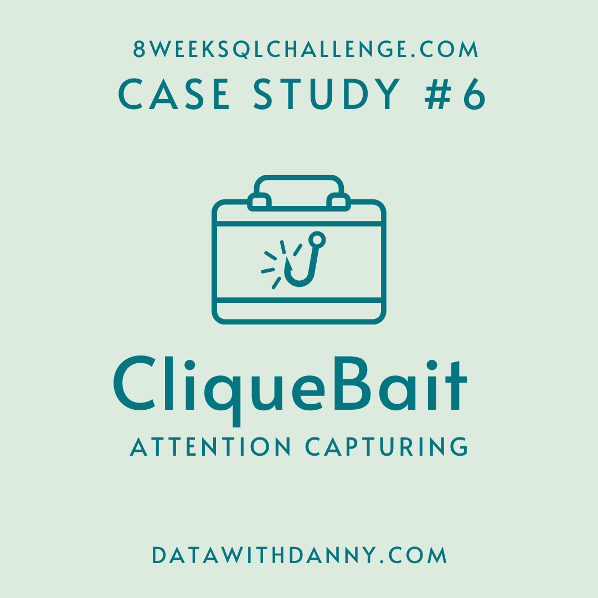
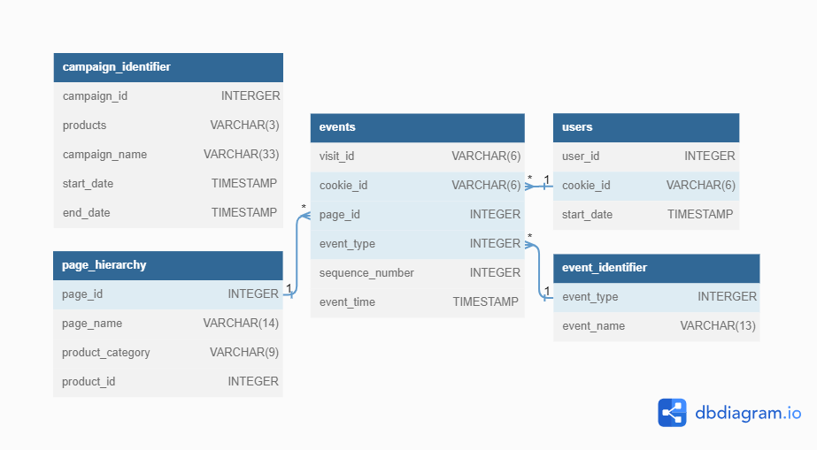

# :fish: Case Study 6 - Clique Bait

  <picture>
    
  </picture>

## :books: Table of Contents <!-- omit in toc -->

- [:briefcase: Business Case](#briefcase-business-case)
- [:mag: Entity Relationship Diagram](#mag-entity-relationship-diagram)
- [:bookmark_tabs: Example Datasets](#bookmark_tabs-example-datasets)
- [:triangular_flag_on_post: Questions and Solutions](#triangular_flag_on_post-questions-and-solutions)
  
---

## :briefcase: Business Case

Clique Bait is not like your regular online seafood store - the founder and CEO Danny, was also a part of a digital data analytics team and wanted to expand his knowledge into the seafood industry!

In this case study - you are required to support Danny’s vision and analyse his dataset and come up with creative solutions to calculate funnel fallout rates for the Clique Bait online store.

View the complete business case [HERE](https://8weeksqlchallenge.com/case-study-6).

---

## :mag: Entity Relationship Diagram

  <picture>
    
  </picture>	

---

## :bookmark_tabs: Example Datasets

**Table 1: users**

| user_id | cookie_id | &nbsp;&nbsp;&nbsp;&nbsp;&nbsp;&nbsp;&nbsp;&nbsp;start_date |
| :------ | :-------- | :------------------ |
| 397     | 3759ff    | 2020-03-30 00:00:00 |
| 215     | 863329    | 2020-01-26 00:00:00 |
| 191     | eefca9    | 2020-03-15 00:00:00 |
| 89      | 764796    | 2020-01-07 00:00:00 |
| 127     | 17ccc5    | 2020-01-22 00:00:00 |
| 81      | b0b666    | 2020-03-01 00:00:00 |
| 260     | a4f236    | 2020-01-08 00:00:00 |
| 203     | d1182f    | 2020-04-18 00:00:00 |
| 23      | 12dbc8    | 2020-01-18 00:00:00 |
| 375     | f61d69    | 2020-01-03 00:00:00 |

 

**Table 2: events**

| visit_id | cookie_id | page_id | event_type | sequence_number | &nbsp;&nbsp;&nbsp;&nbsp;&nbsp;&nbsp;&nbsp;&nbsp;&nbsp;&nbsp;&nbsp;&nbsp;&nbsp;&nbsp;event_time |
| :------- | :-------- | :------ | :--------- | :-------------- | :------------------------- |
| 719fd3   | 3d83d3    | 5       | 1          | 4               | 2020-03-02 00:29:09.975502 |
| fb1eb1   | c5ff25    | 5       | 2          | 8               | 2020-01-22 07:59:16.761931 |
| 23fe81   | 1e8c2d    | 10      | 1          | 9               | 2020-03-21 13:14:11.745667 |
| ad91aa   | 648115    | 6       | 1          | 3               | 2020-04-27 16:28:09.824606 |
| 5576d7   | ac418c    | 6       | 1          | 4               | 2020-01-18 04:55:10.149236 |
| 48308b   | c686c1    | 8       | 1          | 5               | 2020-01-29 06:10:38.702163 |
| 46b17d   | 78f9b3    | 7       | 1          | 12              | 2020-02-16 09:45:31.926407 |
| 9fd196   | ccf057    | 4       | 1          | 5               | 2020-02-14 08:29:12.922164 |
| edf853   | f85454    | 1       | 1          | 1               | 2020-02-22 12:59:07.652207 |
| 3c6716   | 02e74f    | 3       | 2          | 5               | 2020-01-31 17:56:20.777383 |

 

**Table 3: event_identifier**

| event_type | event_name    |
| :--------- | :------------ |
| 1          | Page View     |
| 2          | Add to Cart   |
| 3          | Purchase      |
| 4          | Ad Impression |
| 5          | Ad Click      |

 

**Table 4: campaign_identifier**

| campaign_id | products |&nbsp;&nbsp;&nbsp;&nbsp;&nbsp;&nbsp;&nbsp;&nbsp;&nbsp;&nbsp;&nbsp;&nbsp;&nbsp;&nbsp;&nbsp;campaign_name | &nbsp;&nbsp;&nbsp;&nbsp;&nbsp;&nbsp;&nbsp;&nbsp;&nbsp;start_date | &nbsp;&nbsp;&nbsp;&nbsp;&nbsp;&nbsp;&nbsp;&nbsp;&nbsp;end_date |
| :---------- | :------- | :-------------------------------- | :------------------ | :------------------ |
| 1           | 1-3      | BOGOF - Fishing For Compliments   | 2020-01-01 00:00:00 | 2020-01-14 00:00:00 |
| 2           | 4-5      | 25% Off - Living The Lux Life     | 2020-01-15 00:00:00 | 2020-01-28 00:00:00 |
| 3           | 6-8      | Half Off - Treat Your Shellf(ish) | 2020-02-01 00:00:00 | 2020-03-31 00:00:00 |

 

**Table 5: page_hierarchy**

| page_id | page_name      | product_category | product_id |
| :------ | :------------- | :--------------- | :--------- |
| 1       | Home Page      | null             | null       |
| 2       | All Products   | null             | null       |
| 3       | Salmon         | Fish             | 1          |
| 4       | Kingfish       | Fish             | 2          |
| 5       | Tuna           | Fish             | 3          |
| 6       | Russian Caviar | Luxury           | 4          |
| 7       | Black Truffle  | Luxury           | 5          |
| 8       | Abalone        | Shellfish        | 6          |
| 9       | Lobster        | Shellfish        | 7          |
| 10      | Crab           | Shellfish        | 8          |
| 11      | Oyster         | Shellfish        | 9          |
| 12      | Checkout       | null             | null       |
| 13      | Confirmation   | null             | null       |

View my database setup in:

---

## :triangular_flag_on_post: Questions and Solutions

### A. Digital Analysis

1. How many users are there?
2. How many cookies does each user have on average?
3. What is the unique number of visits by all users per month?
4. What is the number of events for each event type?
5. What is the percentage of visits which have a purchase event?
6. What is the percentage of visits which view the checkout page but do not have a purchase event?
7. What are the top 3 pages by number of views?
8. What is the number of views and cart adds for each product category?
9. What are the top 3 products by purchases?

View my solution in:

---

### B. Product Funnel Analysis

Create a new output table which has the following details:
  * How many times was each product viewed?
  * How many times was each product added to cart?
  * How many times was each product added to a cart but not purchased (abandoned)?
  * How many times was each product purchased?

Additionally, create another table which further aggregates the data for the above points but this time for each product category instead of individual products.

1. Which product had the most views, cart adds and purchases?
2. Which product was most likely to be abandoned?
3. Which product had the highest view to purchase percentage?
4. What is the average conversion rate from view to cart add?
5. What is the average conversion rate from cart add to purchase?

View my solution in:
 

---

### C. Campaigns Analysis

Generate a table that has 1 single row for every unique `visit_id` record and has the following columns:
  * `user_id`
  * `visit_id`
  * `visit_start_time`: the earliest `event_time` for each visit
  * `page_views`: count of page views for each visit
  * `art_adds`: count of product cart add events for each visit
  * `purchase`: 1/0 flag if a purchase event exists for each visit
  * `campaign_name`: map the visit to a campaign if the `visit_start_time falls` between the `start_date` and `end_date`
  * `impression`: count of ad impressions for each visit
  * `click`: count of ad clicks for each visit
  * `cart_products`: a comma separated text value with products added to the cart sorted by the order they were added to the cart

Some ideas to investigate further include:
  * Identifying users who have received impressions during each campaign period and comparing each metric with other users who did not have an impression event.
  * Does clicking on an impression lead to higher purchase rates?
  * What is the uplift in purchase rate when comparing users who click on a campaign impression versus?
users who do not receive an impression? What if we compare them with users who have just an impression but do not click?
  * What metrics can you use to quantify the success or failure of each campaign compared to each other?

View my solution in:

